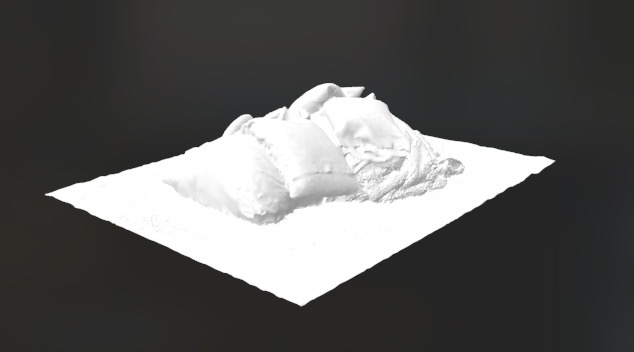
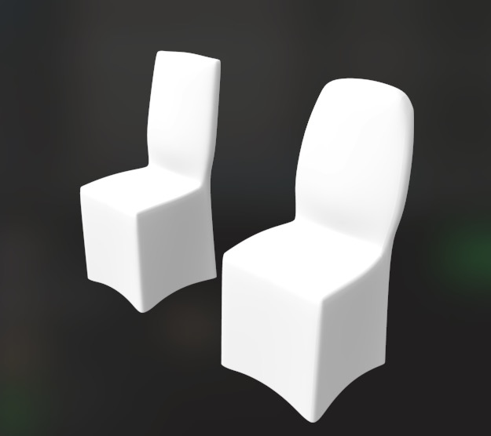

# Objeverse OBJ Download Instructions

## Steps to Download and Normalize OBJ Files

1. **Set YAML for the Desired Tag**
   - Create or modify your `config.yaml` file to include the desired tag. For example, to download OBJ files for chairs, your YAML should look like this:
   ```yaml
   tag: "chair"
   ```

2. **Run the Download Script**
   - Execute the download script to fetch the OBJ files associated with the specified tag. Make sure you have the necessary permissions and dependencies installed. You can run the script using the following command:
   ```bash
   python download_objeverse.py
   ```

3. **Manually Remove Duplicate Objects or Incorrectly Tagged OBJ Files**




When downloading OBJ files, you may encounter incorrectly tagged objects that do not match the desired category. Here are some common reasons for incorrect tagging:

- **File Naming Issues**: The file names may not correspond to the expected tags, leading to confusion during the download process.
- **Corrupted Files**: Some OBJ files may be corrupted or improperly formatted, making them unusable for your project.
- **Duplicate Objects**: You might find multiple versions of the same object, which can clutter your dataset.

To remove these incorrect OBJ files, follow these steps:

- **Identify the Incorrect Files**: Review the downloaded files and compare them against your expected list of objects based on the tag specified in your `config.yaml`.
- **Delete Unwanted Files**: Manually delete the files that do not match the expected criteria. You can do this through your file explorer or using command line commands such as `rm` on Unix-based systems or `del` on Windows.

4. **Verify Remaining Files**: After deletion, double-check the remaining files to ensure they are correctly tagged and usable for your project.

    ```
    python format_objeverse.py
    ```

By following these steps, you can download and maintain a clean and accurate dataset for your OBJ files from Objeverse.data_path
