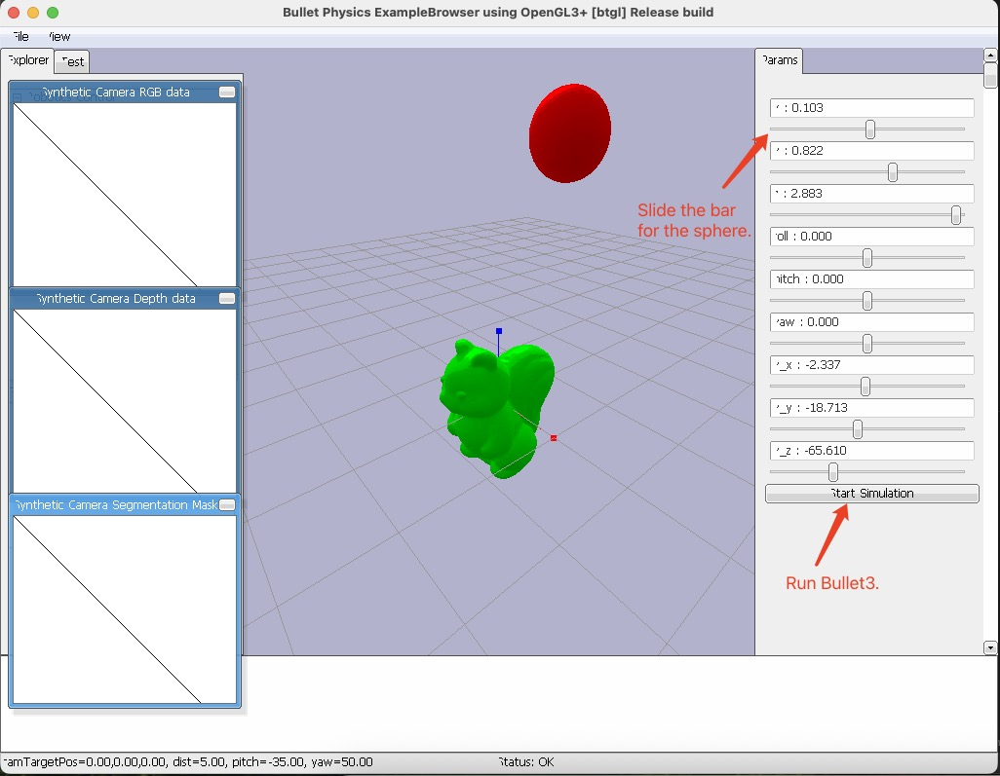

<p align="center">

  <h2 align="center">DeepFracture: Code and Demo
    <p align="center" style="font-size: small;">  The Eye of  Breaking Perception </p>
  </h2>
  
  <p align="center">
    <a href="https://nikoloside.graphics/"><strong>Yuhang Huang</strong></a>
    ·
    <a href="https://graphics.c.u-tokyo.ac.jp/hp/en/kanai"><strong>Takashi Kanai</strong></a>
    <br>
    <br>
        <a href="https://onlinelibrary.wiley.com/doi/10.1111/cgf.70002"></a>
        <a href='https://nikoloside.graphics/deepfracture/'></a>
        <a href='https://github.com/nikoloside/TEBP'></a>
        <a href='https://huggingface.co/datasets/nikoloside/break4models'></a>
    <br>
    <b>The University of Tokyo &nbsp;
    <div align="center" style="text-align: center;"><a href="http://www.replicabilitystamp.org#https-github-com-nikoloside-tebp"></a><p>DeepFracture has been awarded the GRSI Replicability Stamp.</p></div>
  </p>
  
  <table align="center">
    <tr>
    <td>
      
    </td>
    </tr>
  </table>
  

## Progress

- [x] Network Benchmark
- [x] 4 Models Drive Google
- [x] Release MeshBoolean Code (2025/7/15)
- [x] Release MorphoSeg Code  (2025/7/15)
- [x] Easy-Run Official Code Release
- [x] Release clean codebase.
- [x] Release pre-trained checkpoints.
- [x] Release 4 Models Drive Google.
- [x] Release Demo Codebase  (2025/7/15)
- [x] Release pipeline with a public license.
- [ ] Release Demo Page.
- [ ] Release Evaluation Code

## Overview

This project serves as the code base for the DeepFracture and The Eye of Breaking Perception paper. It encompasses various components essential for generating, processing, and training models on fracture simulations. The following sections outline the key components of the code base.

### Components

1. **Data Generation**
   - **Download Obj** and **Create Bullet**This module is responsible for downloading and preparing the necessary 3D object files (OBJ) for the simulation. It includes scripts for normalizing and converting OBJ files into formats suitable for the fracture simulation.
   - **Running FractureRB Toolkits**
   - The FractureRB component is designed to simulate the behavior of fractured materials. This module allows users to run simulations using the Bullet Physics engine, providing insights into the dynamics of fractured objects.

3. **Cook Data**
   - This component processes the generated data, preparing it for training. It includes data cleaning, normalization, and formatting to ensure compatibility with the training algorithms.

4. **Training**
   - The training module implements machine learning algorithms to train models on the processed fracture data. It includes scripts for model selection, hyperparameter tuning, and evaluation metrics.

5. **Run-time**
   - This section encompasses various runtime environments for executing the simulations:
   - **Havok Version**: A runtime environment utilizing the Havok Physics engine for high-performance simulations.
   - **PyBullet Version**: A version that leverages the PyBullet physics engine, providing a flexible and easy-to-use interface for running simulations.
   - **Morpho Seg**: This component focuses on segmenting the mesh data based on morphological features, enhancing the simulation's realism.
   - **Mesh Boolean**: This module allows for complex boolean operations on meshes, enabling the creation of intricate fracture patterns.


## Getting started

### Installation

```sh
git clone https://github.com/nikoloside/TEBP
cd TEBP
git submodule update --init --recursive 00.third-party/bullet3 00.third-party/Manifold

# Install dependencies and build third-party libraries
python setup.py

# JAVA_HOME has been added to your shell profile.

# To apply the change now, reload your profile or open a new terminal:
# - zsh:   source ~/.zshrc
# - bash:  source ~/.bashrc   (or ~/.profile / ~/.bash_profile, depending on your setup)
# - fish:  source ~/.config/fish/config.fish
source ~/.zshrc
```

### Quick-Start Run-time

```
python3 ./04.Run-time/predict-runtime.py --shape squirrel --csv-num 260 --auto-run
```


## Dependencies

The `python setup.py` command automatically handles the installation of all required dependencies and builds third-party libraries. However, you may need to install some system dependencies manually:

### System Dependencies (Option, covered by setup.py)

**Java Development Kit (JDK) is required:**

- **For MacOS (using Homebrew):**
```bash
brew install --cask temurin
export JAVA_HOME=$(/usr/libexec/java_home)
```

- **For MacOS (using MacPorts):**
```bash
sudo port install openjdk24-temurin
export JAVA_HOME=/opt/local/libexec/openjdk24.0.1
```

- **For Ubuntu:**
```bash
sudo apt update
sudo apt install openjdk-21-jdk
export JAVA_HOME=/usr/lib/jvm/java-21-openjdk-amd64
```

Add the JAVA_HOME export to your shell profile (`.bashrc`, `.zshrc`, or `.profile`):
```bash
echo 'export JAVA_HOME=/path/to/your/java' >> ~/.bashrc
source ~/.bashrc
```

### Python Dependencies (Option, covered by setup.py)

**PyTorch Installation:**

- **For MacOS**

Verified:
MacOS: Macbook Air Apple M2, Mac Studio M3 Ultra
Python: 3.10.17
numpy=1.26.4
openjdk version "24.0.1"

```bash
pip3 install --pre torch torchvision torchaudio --extra-index-url https://download.pytorch.org/whl/nightly/cpu
```

- **For Ubuntu**

**[Verified]**
Ubuntu: 24.04.2 LTS: Intel® Core™ i7-9700 × 8, NVIDIA GeForce RTX™ 2080
Python: 3.11.4
numpy: 1.26.4
openjdk version: "21.0.7"

Please follow the [Pytorch Ubuntu Link](https://pytorch.org/get-started/locally/) for the nightly cuda installation.

```bash
pip3 install --pre torch torchvision torchaudio --index-url https://download.pytorch.org/whl/nightly/cpu
```

## Datasets

We provide the generation method of pre-fracture data. 
However, we can not release the FractureRB code. You can find the generated 4 models data here:
[Hugging Face dataset](https://huggingface.co/datasets/nikoloside/break4models)

We plan to provide the generated fractured datasets for all 7 categories separately.

## Training

Download the dataset above, and put the data as "./TEBP/data/dataset/\_out_*(targetName)/"

- impact/*.txt
- data/dataset/_out_*(targetName)/*.txt
- data/dataset

Change the config.yaml

```yaml
# 01 Data Generation
shape_category: "mug"
foundation_path: "/Users/(Your Path)/TEBP"
```

Change the path.

```bash
python 03.Training/train.py
```

## Evaluation & Run-time (Option, Check Quick-Start Run-time)

### Pre-trained models

Pre-trained networks is downloaded in the `setup.py` as [Hugging Face model](https://huggingface.co/nikoloside/deepfracture).
We stored them as `*.pt` files in specific folder `*(Shape Name)`.

If you want to use the pre-trained model, please:
```python
from predict.Model.load_VQfinal2resolutionv2 import MultiLatentEncoder, AutoDecoder

models[i] = model_path

world.CreateBreakableObj(objName, pos, rot, lVel, aVel, paths[i], colors[i], staticsMass[i], frictions[i], restitutions[i], fracturePaths[i], garagePaths[i], models[i], isBig[i], maxValues[targetName[i]], False, ws)
```

Please refer to [`predict-runtime.py`](04.Run-time/predict-runtime.py) for seeking the whole code example.


#### Set-up MeshBool & Config.yaml

1. Option 1: We Use Houdini for measuring MeshBool officially

Change your houdini path both in config.yaml and ./04.Run-time/

- ./config.yaml
```yaml
use_houdini: True
houdini_path: "/Applications/Houdini/Houdini20.5.584/Frameworks/Python.framework/Versions/3.11/bin/python3.11"
houdini_libs: "/Applications/Houdini/Houdini20.5.584/Frameworks/Houdini.framework/Versions/Current/Resources/houdini/python3.11libs/"
```

- ./04.Run-time/MeshBoolean/houdini_process.py
```python
houdini_path = "/Applications/Houdini/Houdini20.5.584/Frameworks/Python.framework/Versions/3.11/bin/python3.11"
houdini_libs = "/Applications/Houdini/Houdini20.5.584/Frameworks/Houdini.framework/Versions/Current/Resources/houdini/python3.11libs/"
```

2. Option 2: Use python code for starting MeshBool quickly

- ./config.yaml
```yaml
use_houdini: False
```

#### Instructions


```bash
# Use neural network to predict fracture patterns (default)
python 04.Run-time/predict-runtime.py

# Use existing pre-computed fracture patterns (don't predict)
python 04.Run-time/predict-runtime.py --use_fractured_pattern

# For generating obj animation sequences
python 04.Run-time/predict-runtime.py --save-animation

# For auto-run mode with neural network prediction
python 04.Run-time/predict-runtime.py --auto-run

# For specific shape with auto-run and neural network prediction
python3 ./04.Run-time/predict-runtime.py --shape squirrel --csv-num 260 --auto-run
```

By following these instructions, you can effectively utilize the DeepFracture code base to explore run-time code.



**Fracture Modes:**
- **Use neural network to predict fracture patterns**: Default behavior (no flag needed)
- **Use existing pre-computed fracture patterns**: Use `--use_fractured_pattern` flag
- **Generating obj animation sequences**: Use `--save-animation` flag
- **Both using existing patterns and saving**: Use `--use_fractured_pattern --save-animation` flags

**Manual Configuration:**
You can also manually set the fracture mode in the code:

```python
isFracturing = True   # Set to True to use neural network prediction, False to use existing patterns
isSaving = False      # Set to True to save animation sequences

world = BreakableWorld(isDirect = False, bulletFile = "", needOutput = isSaving, allowAutoFracture = isFracturing, timeRange = 20, hasGravity = False, collisionNum = collisionNum, impulseMax = impulseMax)
```

### Auto-Run (Option)

Please use it for auto run all tests.

```bash
# Make script executable
chmod +x 05.Measure/Graphs/auto-run-time.sh

# Run the script
./05.Measure/Graphs/auto-run-time.sh

# Or run individual commands
python3 04.Run-time/predict-runtime.py --shape bunny --csv-num 260 --auto-run
python3 04.Run-time/predict-runtime.py --shape squirrel --csv-num 260 --auto-run
python3 04.Run-time/predict-runtime.py --shape base --csv-num 261 --auto-run
python3 04.Run-time/predict-runtime.py --shape pot --csv-num 79 --auto-run
```

## Acknowledgements

- The fracture code was created using [FractureRB](https://github.com/david-hahn/FractureRB). 
- Thanks to @fangsunjian for generous help with debugging.
- Thanks to the Graphics Replicability Stamp Initiative (GRSI) for their support and thorough review.

## Citation

If you found this code or paper useful, please consider citing:
```bibtex
@article{huang2025deepfracture,
        author = {Huang, Yuhang and Kanai, Takashi},
        title = {DeepFracture: A Generative Approach for Predicting Brittle Fractures with Neural Discrete Representation Learning},
        journal = {Computer Graphics Forum},
        pages = {e70002},
        year = {2025},
        keywords = {animation, brittle fracture, neural networks, physically based animation},
        doi = {https://doi.org/10.1111/cgf.70002},
        url = {https://onlinelibrary.wiley.com/doi/abs/10.1111/cgf.70002},
        eprint = {https://onlinelibrary.wiley.com/doi/pdf/10.1111/cgf.70002}
      }
```

## Contact

If you encounter any issues or have questions, please open an issue or reach out to `nikoloside[at]gmail[dot]com`. 
Additionally, we do not have permission to release any code or built versions related to HyenaLib and FractureRB. Please contact the original providers of HyenaLib or FractureRB for further assistance.

Nonetheless, we utilized Docker to create an Ubuntu 14 environment and built the wrapper code for HyenaLib using the prebuilt g++-4.9 provided in FractureRB.
